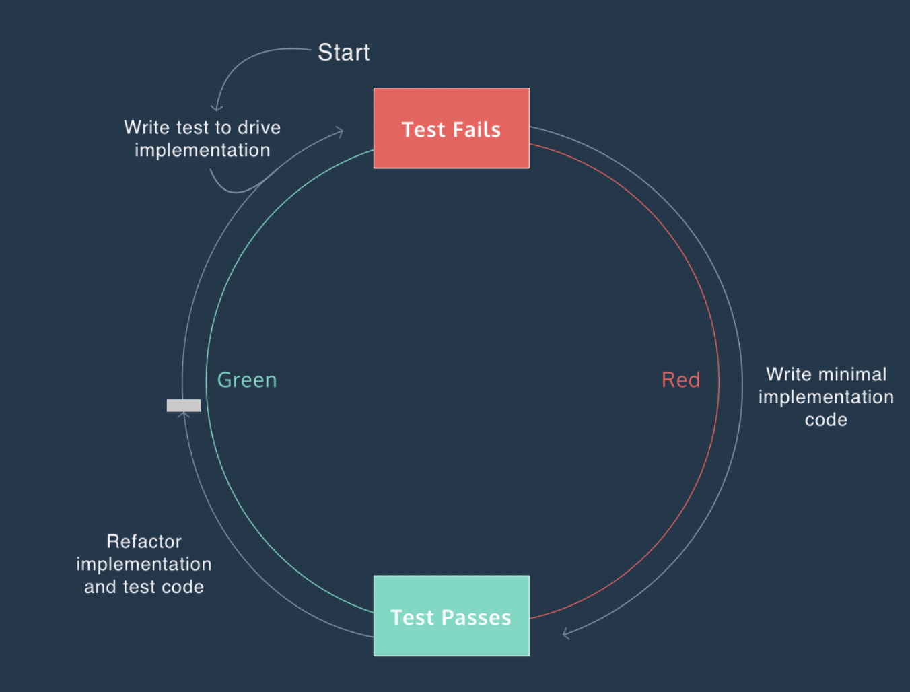
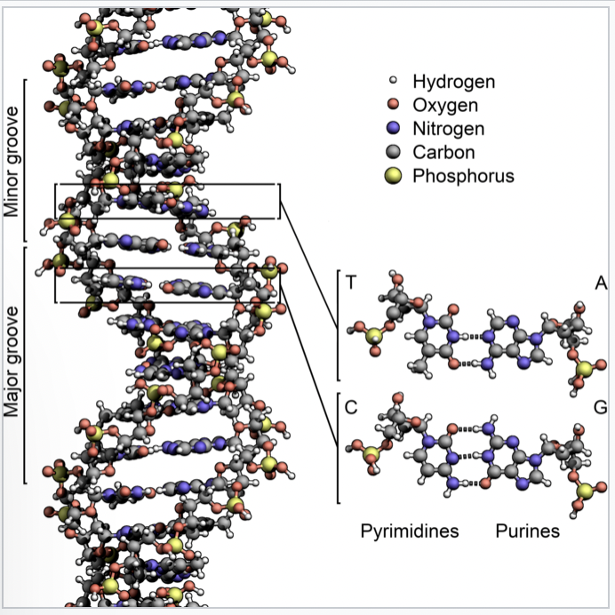

# Exercise 4: Test Driven Development

## Introduction

In this small exercise, we are going to develop a specific class using the principles of test driven development (TDD). In short this means that you first write your tests and after that you write the code that makes your test pass. And this in an cyclic manner – the so-called [Red-Green-Refactor cycle](https://www.codecademy.com/article/tdd-red-green-refactor).



## 1: basic setup

Of course, you could populate your production code with all sorts of `assert`-statements in order to keep a check on its proper workings. However, keeping all your tests in one place has several advantages:

- it keeps your code nicely seperated from the tests
- it allows you to run tests independently
- you can make use of fixtures throughout all your tests
- it simplyfies the running of tests

In these exercises, we are going to make use of [the package `pytest`](https://docs.pytest.org/en/7.1.x/), so we need to install that first. After that, we need to build our application structure for `pytest` to automatically find and run all the tests. We are first going to recreate the setup that was demonstrated during the lecture; after that, you will write your code in the `bin` directory and your tests in the (drum-roll) `tests`-directory.

```python
(venv) $ python -m pip install pytest
```

Now create the following structure:

```
├── bin
│   ├── __init__.py
│   └── summing.py
└── tests
    ├── __init__.py
    ├── conftest.py
    ├── pytest.ini
    └── test_sum
        ├── __init__.py
        └── test_summing.py
```

Create two *empty* functions in `bin/summing.py` (just declare the function signatures and give them `pass`): `simple_sum` and `multiple_sum`. Provide the file `test_summing.py` with tests for these functions. Use the following lines of code to tests those functions:

```python
def test_sum():
    assert simple_sum(3,3) == 6, 'should be 6'

def test_another_sum():
    assert multiple_sum(1,2,3,4,5) == 15
```

If all goes well, and you run `python -m pytest tests`, you will see that the tests fail, which is quite understandable, as we have not given any implementation to the methods yet.

The function `simple_sum` needs to accept exactly two parameters and returns the sum of those two. The second method `multiple_sum` needs to accept any number of parameters and returns the complete sum of all those parameters. Implement these methods and make sure that the tests will succeed when you are finished.

## 2: DNA

In this second exercise, we create a class `DNA` in a test-driven manner. That means that we first create the test-cases and after that the implementing code. 

Out `DNA`-class will be relatively simple; it needs to be able to fulfill the following five functional requirements:

1. When creating an object of type `DNA`, a string of nucleotides must be provided. This string should *only* contain the characters `A`, `C`, `T`, `G` and the total length should be a multiple of three.

2. When an object of `DNA` is printed, it should print out the complete string of DNA that is stored in its memory.

3. It should be possible to *add* a triplet of `A`, `C`, `T`, or `G` to the existing dna-string. 

4. One can iterate over objects of the class `DNA`. Within every iteration, the *next triplet* of nucleotides should be returned, until the complete dna-string is consumed.

5. Objects of the class `DNA` should be immutable.

See the code listing below to get an idea of the workings of this class

```ipython
In [1]: from bin.dna import DNA

In [2]: dna = DNA('ACTGACTGACTG')

In [3]: dna
Out[3]: ACTGACTGACTG

In [4]: dna = dna+'ACG'

In [5]: dna
Out[5]: ACTGACTGACTGACG

In [6]: for triplet in dna:
   ...:     print (triplet)
   ...: 
ACT
GAC
TGA
CTG

In [7]: 
```

First, create tests for all of those requirements. It would be best to create so-called *positive tests* (that check whether the class works as expected with correct input), but also *negative tests* (to show that things break when provided wrong input). 

Implements the tests in your test-class and commit your code to github when you're done.



The last step of this exercise will be given orally when everybody is done.

##  3: Discussion

Think about the project that you did last semester. How would you use unit testing and TDD to test parts of your code? What critical parts do you think should be developed and tested in this manner? 

How do you see these technologies in your current project?
