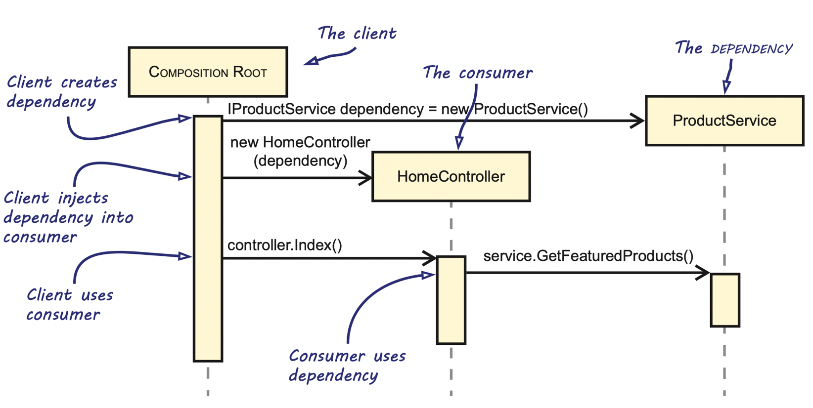

# Exercise 5: Dependency Injection

In this exercise we are going to make use of the [Reader and the CsvConverter that we created in exercise 3](exercise3.md). You can use your own implementation, or use [this example realisation](files/reader.py). We will change this class into a service and inject that into a client-class.

## Step 1: changing the `Reader`

In the third exercise, we created the method `get_lines()` and an internal pointer to have the `Reader` read and return the next stride of lines from the csv-file. Change this class into a generator, so that we can either iterate over it, or just call `next()`. Remove any implementations that you have created to implement the observer pattern. Check the code below to get an idea of the required workings:

```ipython
In [1]: from reader import Reader

In [2]: reader = Reader('dSST.csv', 5)

In [3]: for l in reader:
   ...:     print (len(l))
   ...: 
5
5
 
# (about 28 times 5)
```

## Step 2: creating the client

Now that we have created the generator, we are going to make a client called `Processor` that makes use of it in the form of a service. Have a look a the image below:



In this case, the composition root will be where script you are going to use to construct the object graph. The `Reader`-class will be the *dependecy* (`ProductService` in the image), while `Processor` is the consumer (`HomeController` in the image). Of course, you have to make use of the DI-pattern.

The `Processor` has basically the same functionality as one of the observers of week 3. Only this time it is requires to have some (very basic) interaction with a user. The user can ask for either five time a general average temperature (the average temperature of all the five years in the stride, horizontally so to say) of the average temperature of all the months over these five years (vertically). Or the user can as for the next stride of data. See the example below:

```shell
********************
Welcome to the awesome data processor.
********************
Please select one of the following:
  1. get horizontal data
  2. get vertical data
  3. get next stride of data
  9. quit and exit
Please enter your selection: 1
horizontal data goes here
{'Jan': -0.198, 'Feb': -0.148, 'Mar': -0.13, 'Apr': -0.216, 'May': -0.202, 'Jun': -0.244, 'Jul': -0.168, 'Aug': -0.158, 'Sep': -0.204, 'Oct': -0.204, 'Nov': -0.222, 'Dec': -0.186}
Please select one of the following:
  1. get horizontal data
  2. get vertical data
  3. get next stride of data
  9. quit and exit
Please enter your selection: 9
bye!
```

After this, make use of the composition root pattern within your application's entry point (the point where `__name__=='__main__'` returns `True`)

## Discussion

Do you see possibilities with this architecture within your own projects? How would you seperate the *production* of data from the *consummation* of it?


